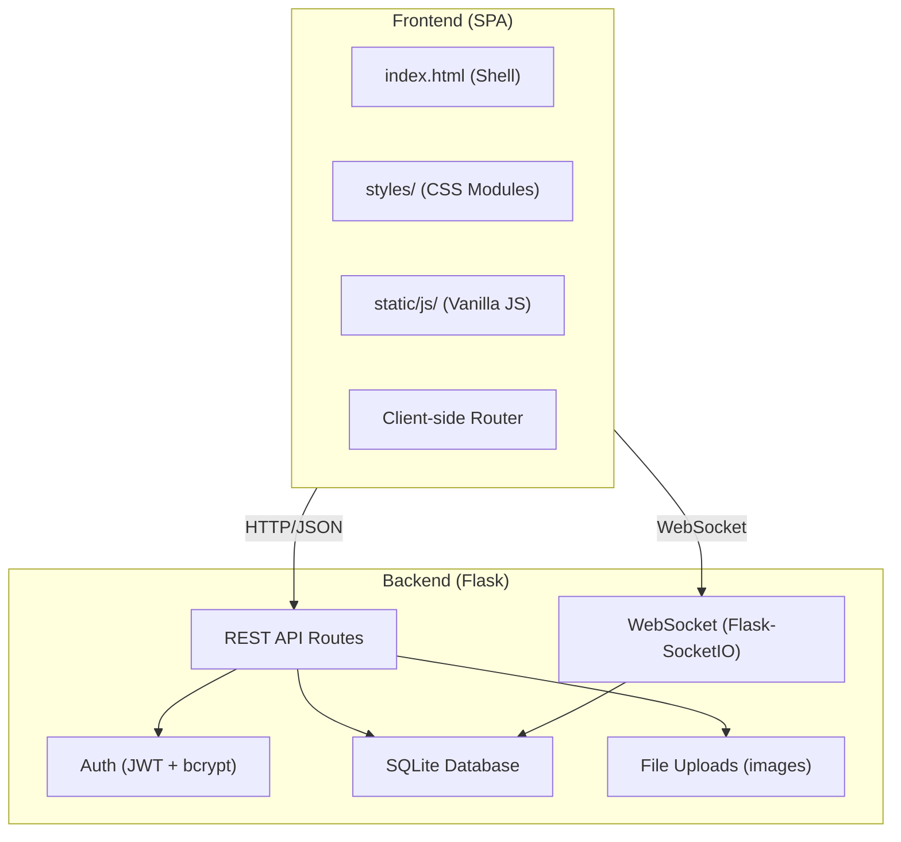

# MySocial — Modern Social Media Web App

A full-featured social media platform with Instagram-style posting, real-time messenger chat, user profiles, search, and settings — built with Python (Flask) and a premium vanilla HTML/CSS/JS frontend.

## Current State

You already have a basic Flask API with:
- User registration (`/register`) 
- Post creation (`/posts`)
- SQLite database with `users`, `posts`, `follows` tables
- A `.venv` with only `pip` installed

We'll **rebuild and expand** from this foundation into a complete, polished application.

---

## Architecture Overview



### Tech Stack

| Layer | Technology | Why |
|-------|-----------|-----|
| Backend | **Flask** + **Flask-SocketIO** | Lightweight, your existing code, real-time chat |
| Database | **SQLite** | Zero setup, sufficient for this scale |
| Auth | **bcrypt** + **JWT (PyJWT)** | Industry-standard password hashing & stateless auth |
| File Uploads | Flask built-in + **Pillow** | Image resizing/thumbnailing for posts & avatars |
| Frontend | **Vanilla HTML/CSS/JS** | SPA with client-side router, no framework overhead |
| Real-time | **Socket.IO** (client + server) | Bidirectional real-time messaging |

### Design Aesthetic

- **Dark mode primary** with optional light mode toggle
- **Glassmorphism** cards with backdrop-filter blur
- **Gradient accents** (purple → pink → orange palette)
- **Google Font**: Inter for clean, modern typography
- **Micro-animations** on all interactive elements
- **Mobile-first** responsive layout (bottom nav on mobile, sidebar on desktop)

---

## Proposed Changes — Phased Approach

### Phase 1: Project Foundation & Authentication

> Set up the project structure, install dependencies, rebuild the database schema, and implement secure login/registration with JWT.

#### [MODIFY] [schema.sql](file:///d:/my_social/schema.sql)
- Expand `users` table: add `display_name`, `bio`, `avatar_url`, `is_online`, `last_seen`
- Add `likes` table (user_id, post_id)
- Add `comments` table (user_id, post_id, content)
- Add `messages` table (sender_id, receiver_id, content, read_at, created_at)
- Add `conversations` table (id, participant_1, participant_2, last_message_at)
- Remove inline SQL queries from schema file (the SELECT/UPDATE at bottom)

#### [MODIFY] [init_db.py](file:///d:/my_social/init_db.py)
- Delete old `database.db` before reinitializing
- Add seed data (demo users) for testing

#### [NEW] requirements.txt
```
flask
flask-socketio
flask-cors
bcrypt
PyJWT
Pillow
python-dotenv
eventlet
```

#### [NEW] config.py
- App configuration (SECRET_KEY, UPLOAD_FOLDER, MAX_CONTENT_LENGTH, DATABASE path)
- Load from `.env` file

#### [MODIFY] [app.py](file:///d:/my_social/app.py)
- Complete restructure into a proper Flask application
- Add JWT-based authentication middleware
- Registration with bcrypt password hashing
- Login endpoint returning JWT token
- Token validation decorator (`@login_required`)
- CORS support for development

#### [NEW] static/index.html
- SPA shell: single `<div id="app">` with navigation
- Bottom navigation bar for mobile (Home, Search, Create, Messages, Profile)
- Side navigation for desktop
- Loading states and transition containers

#### [NEW] static/css/main.css
- CSS custom properties (design tokens): colors, spacing, typography, shadows
- Dark/light theme variables
- Glassmorphism card styles
- Responsive breakpoints (mobile-first)
- Animation keyframes
- Bottom nav & sidebar layout

#### [NEW] static/css/auth.css
- Login/register page styles with gradient background
- Floating glass card form
- Input animations

#### [NEW] static/js/app.js
- Client-side SPA router (hash-based: `#/home`, `#/profile`, `#/messages`, etc.)
- View rendering system
- Global state management (current user, token)
- API client wrapper (fetch with JWT headers)

#### [NEW] static/js/auth.js
- Login/Register form rendering
- Form validation with animated error states
- JWT token storage (localStorage)
- Auto-redirect on valid session

---

### Phase 2: Posting & Feed System (Instagram-style)

> Image/text posts, like & comment, home feed from followed users, user profile gallery.

#### [MODIFY] [app.py](file:///d:/my_social/app.py)
- **POST /api/posts** — Create post with optional image upload (multipart/form-data)
- **GET /api/feed** — Home feed: posts from followed users, ordered by recency
- **GET /api/posts/<id>** — Single post detail
- **POST /api/posts/<id>/like** — Toggle like
- **POST /api/posts/<id>/comment** — Add comment
- **GET /api/posts/<id>/comments** — Get comments
- **DELETE /api/posts/<id>** — Delete own post
- **GET /api/users/<id>/posts** — User's post gallery
- Image upload handling with Pillow resizing (max 1080px width)

#### [NEW] static/js/feed.js
- Home feed view rendering with infinite-scroll-style loading
- Post card component (avatar, username, image, caption, like/comment buttons)
- Like animation (heart burst effect)
- Comment drawer/modal
- Pull-to-refresh on mobile

#### [NEW] static/js/post.js
- Create post modal/page
- Image preview before upload
- Caption input with character count
- Upload progress indicator

#### [NEW] static/css/feed.css
- Post card glassmorphism styling
- Image aspect ratio containers
- Like animation keyframes
- Comment section styles

#### [NEW] static/css/post.css
- Create post modal styles
- Image preview styling
- Upload progress bar

---

### Phase 3: Real-time Messaging (Messenger-style)

> Private 1-on-1 chat with real-time message delivery via WebSocket.

#### [MODIFY] [app.py](file:///d:/my_social/app.py)
- **GET /api/conversations** — List user's conversations with last message preview
- **GET /api/conversations/<id>/messages** — Message history (paginated)
- **POST /api/conversations** — Start new conversation
- **WebSocket events**: `send_message`, `receive_message`, `typing`, `read_receipt`, `user_online`
- Online status tracking

#### [NEW] static/js/chat.js
- Conversation list view (sorted by last message)
- Chat view with message bubbles (sent/received styling)
- Real-time message receiving via Socket.IO
- Typing indicators
- Online status dots
- Message timestamps (relative: "2m ago", "Yesterday")
- New conversation: pick a user and start chatting

#### [NEW] static/css/chat.css
- Conversation list styles
- Message bubble styling (gradient for sent, glass for received)
- Typing indicator animation
- Chat input bar (fixed bottom)

---

### Phase 4: Search & Discovery + User Profiles

> Search users, view profiles, follow/unfollow.

#### [MODIFY] [app.py](file:///d:/my_social/app.py)
- **GET /api/search?q=** — Search users by username/display_name
- **GET /api/users/<id>** — User profile data (posts count, followers, following)
- **POST /api/users/<id>/follow** — Follow/unfollow toggle
- **GET /api/users/<id>/followers** — Follower list
- **GET /api/users/<id>/following** — Following list
- **PUT /api/users/me** — Update own profile (display_name, bio, avatar)

#### [NEW] static/js/search.js
- Search page with animated search bar
- Live search results (debounced)
- User cards with follow button
- Suggested users section (random users not followed)

#### [NEW] static/js/profile.js
- Profile header (avatar, display_name, bio, stats)
- Post grid (Instagram-style 3-column)
- Follow/unfollow button with state
- Edit profile modal (own profile)

#### [NEW] static/css/search.css
- Search bar animation
- User card grid
- Result animations

#### [NEW] static/css/profile.css
- Profile header layout
- Stats bar
- Post grid with hover overlay
- Edit profile modal

---

### Phase 5: Settings & Mobile Polish

> Settings page, theme toggle, notifications, and final mobile optimization.

#### [MODIFY] [app.py](file:///d:/my_social/app.py)
- **PUT /api/users/me/password** — Change password
- **DELETE /api/users/me** — Delete account
- **POST /api/logout** — Invalidate session

#### [NEW] static/js/settings.js
- Settings page with sections: Account, Appearance, Privacy, About
- Theme toggle (dark/light) with smooth transition
- Change password form
- Delete account (with confirmation)
- Logout

#### [NEW] static/css/settings.css
- Settings page layout
- Toggle switch styling
- Section card styles

#### [MODIFY] static/css/main.css
- Final mobile responsiveness pass
- Touch interaction improvements
- Safe area insets for notched phones
- Smooth page transitions
- Performance optimizations (will-change, contain)

---

## File Structure (Final)

```
d:\my_social\
├── app.py                    # Flask application (API + WebSocket)
├── config.py                 # Configuration
├── init_db.py                # Database initialization
├── schema.sql                # Database schema
├── requirements.txt          # Python dependencies
├── database.db               # SQLite database (generated)
├── .env                      # Secrets (SECRET_KEY, etc.)
├── uploads/                  # User-uploaded images
│   ├── avatars/
│   └── posts/
├── static/
│   ├── index.html            # SPA shell
│   ├── css/
│   │   ├── main.css          # Design system & layout
│   │   ├── auth.css          # Login/register styles
│   │   ├── feed.css          # Feed & post card styles
│   │   ├── post.css          # Create post styles
│   │   ├── chat.css          # Messaging styles
│   │   ├── search.css        # Search page styles
│   │   ├── profile.css       # Profile page styles
│   │   └── settings.css      # Settings page styles
│   └── js/
│       ├── app.js            # SPA router & global state
│       ├── auth.js           # Authentication views
│       ├── feed.js           # Home feed
│       ├── post.js           # Create post
│       ├── chat.js           # Messaging
│       ├── search.js         # Search & discovery
│       ├── profile.js        # User profiles
│       └── settings.js       # Settings
└── .venv/                    # Python virtual environment
```

---

## User Review Required

> [!IMPORTANT]
> **Database Reset**: This plan rebuilds `schema.sql` from scratch and reinitializes the database. Your existing `database.db` with any test data will be deleted and recreated.

> [!IMPORTANT]  
> **No External Services**: This plan uses SQLite (file-based) and local file storage. No cloud services, no external APIs. Everything runs locally via `flask run`. If you want cloud deployment (e.g., hosting uploaded images on S3), that would be a separate phase.

## Open Questions

> [!IMPORTANT]
> 1. **Image posts**: Should posts support **only images** (like Instagram), **only text**, or **both text and optional images**? I'm planning for both (text + optional image).

> [!IMPORTANT]
> 2. **Group chat**: Should messaging support only **1-on-1 conversations**, or do you also want **group chats**? I'm planning 1-on-1 only to keep scope manageable.

> [!IMPORTANT]
> 3. **Notifications**: Do you want an in-app notification system (e.g., "X liked your post", "Y started following you")? This adds a `notifications` table and a bell icon. I can add this as a Phase 5 addition if desired.

---

## Verification Plan

### Automated Tests
- Run `py init_db.py` to verify database creation
- Run `py app.py` and test all API endpoints via the browser
- Test WebSocket connections for real-time chat

### Browser Testing
- Test the full user flow: Register → Login → Create Post → View Feed → Like/Comment → Search Users → Follow → Send Message → Update Settings
- Test responsive design at mobile (375px), tablet (768px), and desktop (1440px) widths
- Test dark/light theme toggle
- Test all micro-animations and transitions

### Manual Verification
- Verify image uploads display correctly
- Verify real-time chat message delivery
- Verify JWT auth prevents unauthorized access
